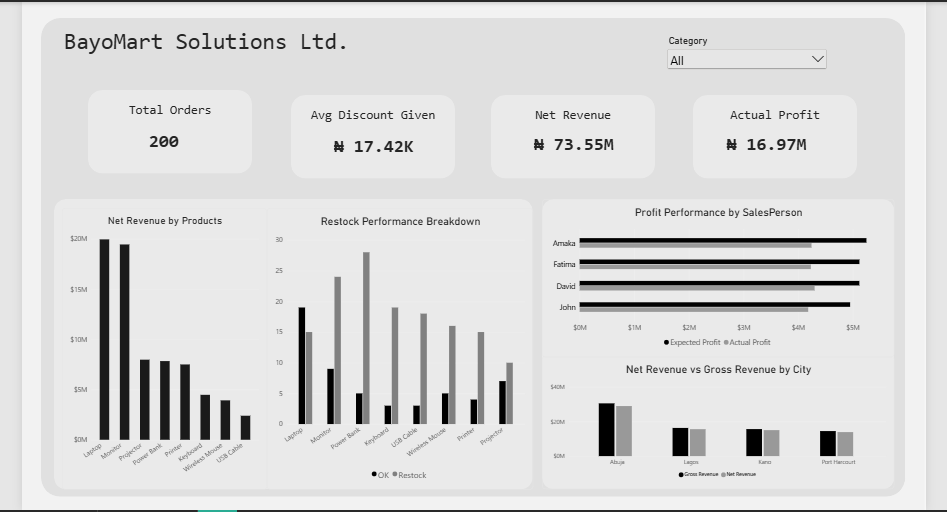

# BayoMart Solutions Ltd. — Sales & Profitability Dashboard

An interactive Power BI dashboard analyzing sales performance, profitability, and inventory health for **BayoMart Solutions Ltd.**, a fictional Nigerian retail/distribution company. The dashboard consolidates orders, discounts, revenue, profit, and restock data into a single view to support commercial decision-making.



## Overview

This project simulates a real-world business intelligence use case: helping a mid-sized company track revenue performance across products, salespeople, and cities, while flagging inventory items that need restocking. It was built to demonstrate dashboard design, DAX measures, and data storytelling skills using Power BI.

## Key Metrics (KPI Cards)

| Metric | Description |
|---|---|
| **Total Orders** | Total number of orders processed |
| **Avg Discount Given** | Average discount value (₦) applied per order |
| **Net Revenue** | Total revenue after discounts and returns |
| **Actual Profit** | Realized profit after costs and discounts |

## Dashboard Components

- **Net Revenue by Products** — Bar chart ranking products (Laptop, Monitor, Projector, Power Bank, Printer, Keyboard, Wireless Mouse, USB Cable) by revenue contribution.
- **Restock Performance Breakdown** — Compares current stock ("OK") against items flagged for restocking across product lines, highlighting inventory risk.
- **Profit Performance by SalesPerson** — Compares Expected Profit vs. Actual Profit per salesperson (Amaka, Fatima, David, John) to track individual performance against targets.
- **Net Revenue vs Gross Revenue by City** — Breaks down revenue by city (Abuja, Lagos, Kano, Port Harcourt) to surface regional performance and the impact of discounts/returns on gross figures.
- **Category Filter** — A slicer to filter the entire dashboard by product category.

## Tools & Technologies

- **Power BI** — data modeling, DAX measures, and visualization
- **Excel** — source data preparation and cleaning

## Insights Surfaced

- Identifies top and bottom-performing products by revenue
- Flags products at risk of stockout based on restock breakdown
- Highlights gaps between expected and actual profit per salesperson
- Shows which cities generate the strongest net revenue relative to gross revenue

## Repository Structure

```
├── dashboard-preview.png     # Screenshot of the dashboard
├── data/                     # Source/sample data used to build the report
├── BayoMart-Dashboard.pbix   # Power BI report file
└── README.md
```

## About

Built by **[Sodeeq Adebayo](https://github.com/Adebayo-tech)**, founder of **Bayo Analytics** — a Nigerian analytics and research firm offering data analytics, psychometric research, and training through Bayo Analytics Academy.

---
*Note: BayoMart Solutions Ltd. is a fictional company created for this portfolio project. Figures are illustrative and not representative of any real business.*
